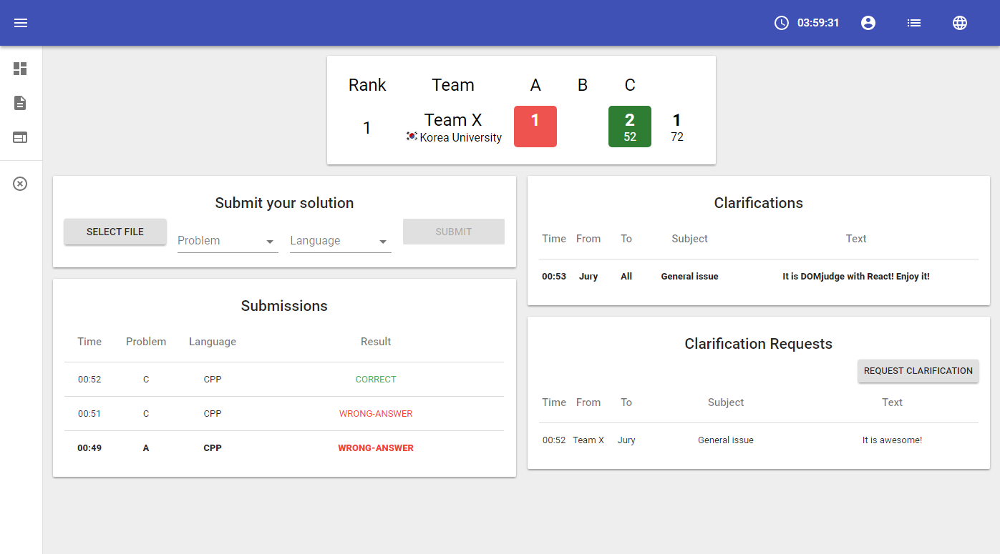

# DOMjudge with React

## What's this?

- Development of [DOMjudge](https://domjudge.org) front-end using React.
- For the full-compatible usage, use own api server instead of DOMjudge's api.
- Fully React-ful application (no page loading except the first time)
- *(It's not a need of competitive programming contest)* We highly support responsive web.
- And new feature which is not in original DOMjudge:
  - Viewing submitted file
  - Desktop notification of new submission result
  - Desktop notification of new clarification
- Support multiple language
  - English
  - Korean
- It is now compatible with **DOMjudge version 5.3.x**



## Requirements

- OS: Windows, Ubuntu, macOS
- Node.js 8+ ([Windows](https://nodejs.org/en/download/package-manager/#windows), [Ubuntu](https://nodejs.org/en/download/package-manager/#debian-and-ubuntu-based-linux-distributions), [macOS](https://nodejs.org/en/download/package-manager/#macos))

## How to install

```bash
git clone https://github.com/myungwoo/react-domjudge.git
cd react-domjudge
npm i && cd client && npm i && cd ..
```

## How to run

### For development
```bash
cd react-domjudge
npm start
```

### For production
```bash
cd react-domjudge
cd client && npm run build && cd ..
NODE_ENV=production PORT=3000 node server.js
```

## Configuration

- API server side: [config.js](./config.js)
- React client side: [client/src/config.js](./client/src/config.js)

## Use our server with Apache2

Run:
```bash
sudo a2enmod proxy
sudo a2enmod proxy_http
```

And at apache2 config file:
```
LoadModule proxy_module modules/mod_proxy.so
LoadModule proxy_http_module modules/mod_proxy_http.so

RedirectMatch ^/react$ /react/
ProxyPass "/react/" "http://localhost:3000/"
ProxyPassReverse "/react/" "http://localhost:3000/"
```
